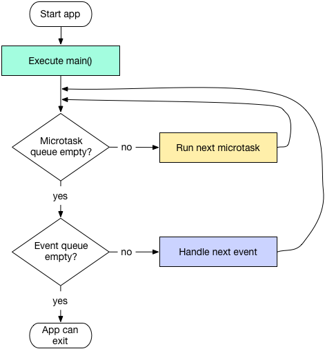

# Dart Futer 详解

在客户端的很多操作需要异步执行，使用callback处理异步，很容易写出回调地狱（Callback hell）代码，导致难以维护。所以在Web端出现了Promise，Android有RxJava，可以使用这些工具，将横向嵌套的callback代码改为纵向扩展，更符合人类的直觉，也更加容易维护。配合async,await更是能以同步的方式写异步代码。

Dart也同样提供了处理异步的工具Future，和JavaScript中的Promise十分相似，有Promise使用经验的人使用Future时会感到十分熟悉。

An object representing a delayed computation.

Future是一个表示延迟计算的对象。代表一些计算将异步进行，并在将来获取到计算的结果。 Future有两种状态:Pending 和 Complete。Pending表示任务正在执行中，还未获取到结果；Complete表示任务已经执行完，并且有结果。 结果有两种值：成功（succeed）或者失败(failed), 我们可以使用回调函数来获取结果值。

#### *事件循环*

和其他客户端开发框架类似(JS中的EventLoop, Android中的Looper，iOS中的RunLoop)，Dart中也有一个无线循环的事件循环，包含两个队列: microtask队列和event队列。Dart会不断地循环访问这两个队列，从中取出任务来执行。microtask队列的优先级高于event队列，如果microtask队列不为空，就从中取出任务执行。当microtask队列为空时，才会访问event队列。

 

通过scheduleMicrotask方法可以向microtask队列中添加任务，而UI事件、Timer等操作和Future的默认构造方法都是添加到event队列中。

### 默认构造方法

#### *Future构造方法*

通过Future的默认构造方法可以创建一个Future对象,。默认构造方法的签名如下

factory Future(FutureOr<T> computation())
 复制代码

参数类型是FutureOr<T> computation()，表示返回值是FutureOr<T>类型的函数。可以根据该函数创建一个Future对象。而FutureOr<T>是一个union类型，代表参数函数的返回值，可以是T类型，也可以是一个Future<T>类型。

通过这个方法创建的Future，computation函数会被添加到event队列中执行。

### 处理结果

#### *then*

创建完成Future对象后，可以通过then方法接收Future的结果。

Future<R> then<R>(FutureOr<R> onValue(T value), {Function onError});
 复制代码

then方法接收两个回调函数参数，onValue接收成功回调，可选的onError接收失败回调。

var future = Future(() {
  //do compution
   return "future value";
  });

 future.then((value) {
   print("onValue: $value");
 }, onError: (error) {
   print("onError $error");
 });
 复制代码

then方法的返回值也是一个Future，可以继续对这个对象调用then方法，注册接收结果的函数。后注册then函数接收的就是前一个then函数的返回值，如果前一个函数没有返回值，后面就接收到null值。 下面代码将会输出
 onValue: future value
 onValue: next value

var future = Future(() {
  //do compution
   return "future value";
  });

 future.then((value) {
   print("onValue: $value");
   return "next value";
 }, onError: (error) {
   print("onError $error");
 }).then((value) {
   print("onValue: $value");
 });
 复制代码

then方法的onValue回调函数的返回值为FutureOr<R>，代表该回调函数可以返回一个Future对象，或者返回一个T类型的值。如果是返回的是Future对象，那么后面通过then注册的回调函数将收到该Future的结果。 下面代码将会输出
 onValue: future value
 onValue: request value

var future = Future(() {
  //do compution
   return "future value";
  });

 future.then((value) {
   print("onValue: $value");
   var otherFuture = Future(() {
     //do request
     return "request value";
   });
   return otherFuture;
 }, onError: (error) {
   print("onError $error");
 }).then((value) {
   print("onValue: $value");
 });
 复制代码

通过这种方式 ，就可以发起多个异步网络请求，从上到下顺序执行，而不是通过callback进行横向嵌套。

#### *catchError*

当Future没有正确的获取到结果发生异常时，除了在then方法中注册onError回调外，还可通过catchError方法监听异常。

Future<T> catchError(Function onError, {bool test(Object error)});
 复制代码

下面代码将会输出
 catchError Exception: exceptin occured

var future = Future(() {
   //do compution
   throw Exception("exception occured");
  });
  future.then((value){
   print("onValue: $value");
  }).catchError((error) {
   print("catchError $error");
  },);
 复制代码

catchError方法还有一个可以选的test函数参数。当发生异常时，会首先调用test函数，如果该函数返回false，异常将不会被catchError函数处理,会继续传递下去；如果test函数返回ture,catchError函数会处理该异常。如果未提供test函数，默认处理为true。

通过then方法的onError参数和catchError方法处理异常有什么不同呢？

这两种方式主要的区别是，通过catchError方法可以捕获到前一个then方法onValue函数中的异常，而通过onError函数方法，无法捕获同一个then方法onValue函数中的异常。

var future = Future(() {
   return "future value";
  });
  future.then((value){
   print("onValue: $value");
   throw Exception("exception occured");
  }, onError: (error) {
   print("onError $error");
  }).catchError((error) {
   print("catchError $error");
  });
 复制代码

上面代码将会输出
 onValue: future value
 catchError Exception: exception occured
 异常被catchError捕获，而onError没有被调用。

#### *whenComplete方法*

Future对象还有一个whenComplete方法，当该Future处于完成状态时，通过该方法注册的回调会被调用，无论结果是成功还是失败，相当与finally代码块。 whenComplete方法的参数类型也是FutureOr类型，返回值为Future<T>类型。表示在该方法中可以返回一个值或者是Future对象，在whenComplete函数后，可以再调用then、catchError等方法，但是后面注册回调函数并不能获取到whenComplete中返回的值，而是whenComplete前的值。 该逻辑等效于下面的代码

 Future<T> whenComplete(action()) {
    return this.then((v) {
     var f2 = action();
     if (f2 is Future) return f2.then((_) => v);
     return v
    }, onError: (e) {
     var f2 = action();
     if (f2 is Future) return f2.then((_) { throw e; });
     throw e;
    });
  }
 复制代码

#### *timeout方法*

Future<T> timeout(Duration timeLimit, {FutureOr<T> onTimeout()})
 复制代码

timeout方法创建一个新的Future对象，接收一个Duration类型的timeLimit参数来设置超时时间。如果原Future在超时之前完成，最终的结果就是该原Future的值；如果达到超时时间后还未完成，就会产生TimeoutException异常。 该方法有一个onTimeout可选参数，如果设置了该参数，当发生超时时会调用该函数，该函数的返回值为Future的新的值，而不会产生TimeoutException。

### 其他构造方法

#### *sync构造方法*

factory Future.sync(FutureOr<T> computation())
 复制代码

将会在当前task执行computation计算，而不是将计算过程添加到任务队列中。

#### *Future.micortask构造方法*

factory Future.microtask(FutureOr<T> computation())
 复制代码

通过scheduleMicrotask方法将computation函数添加到microtask队列中，优先于event队列执行。

factory Future.microtask(FutureOr<T> computation()) {
  _Future<T> result = new _Future<T>();
  scheduleMicrotask(() {
   try {
    result._complete(computation());
   } catch (e, s) {
    _completeWithErrorCallback(result, e, s);
   }
  });
  return result;
 }
 复制代码

下面代码将会输出
 microtask future
 default fauture

Future(() {
   print("default fauture");
 });

 Future.microtask(() {
  print("microtask future");
 });
 复制代码

#### *value构造方法*

factory Future.value([FutureOr<T> value]) {
   return new _Future<T>.immediate(value);
  }
 复制代码

通过value值创建一个Future对象，vuale可以是一个确定的值或者是一个future对象。该方法使用了内部的immediate函数，这个函数会使用scheduleMicrotask在microtask队列中更新Future的值。

#### *error构造方法*

factory Future.error(Object error, [StackTrace stackTrace])
 复制代码

通过error对象和可选的stackTrace创建Future,可以使用该方法创建个一个状态为failed的Future对象。

#### *delayed构造方法*

factory Future.delayed(Duration duration, [FutureOr<T> computation()]);
 复制代码

创建一个延时执行的Future对象，时间由duration参数设置，到达指定事件后，将会执行computation函数。如果computation函数为空，Future的值为null。

#### *wait静态方法*

static Future<List<T>> wait<T>(Iterable<Future<T>> futures,{bool eagerError: false, void cleanUp(T successValue)})
 复制代码

类似于JS中Promise的all方法。wait静态方法可以等待多个Future执行完成，并通过List获取所有Future的结果。如果其中一个Future对象发生异常，会导致最终结果为failed。 该方法有两个可选参数，eagerError和cleanUp。 eagerError默认值为false，当某一个Future发生异常时，默认不会立刻使Future处于failed状态，而是等待所有Future都有结果后，改变状态为failed。如果设置为true，当其中一个Future发生异常时，会立刻导致最终结果为failed， 如果设置了cleanUp参数，当多个Future中的一个发生异常时，其他成功的Future的(非null)结果会传递给cleanUp参数。如果没有发生异常cleanUp函数不会被调用。

### 静态方法

#### *any静态方法*

static Future<T> any<T>(Iterable<Future<T>> futures)
 复制代码

类似于JS中Promise的race方法。any静态方法可以多个Future中第一个处于完成状态的Future的结果，如果第一个完成的Future处于成功状态，则新的Future状态为成功。如果第一个完成的Future处于失败状态，则新的Future状态为失败。其他Future的状态将被忽略。 wait any方法的参数都可以根据参数类型，推断出新的Future类型。如果参数类型相同，则新的Future类型于参数类型一致，如果不同，则为Object类型。

#### *forEach静态方法*

forEach方法有点像Stream的asycMap函数。

static Future forEach<T>(Iterable<T> elements, FutureOr action(T element))
 复制代码

forEach静态方法可以遍历Iterable中的每个元素执行一个操作，如果遍历操作返回的是Future对象，则在该Future完成后再进行下一次遍历，全部完成后返回null。如果在某一次操作中发生异常，会停止遍历，最终的Future的状态为failed。

#### *doWhile静态方法*

static Future doWhile(FutureOr<bool> action())
 复制代码

doWhile静态方法是 do while循环的异步版本。可以一直执行一个action，直到action的值为false。 当循环结束时，doWhile方法返回的Future的值也会是null（为什么要说也）。

### 总结

Future提供了丰富的Api来处理异步任务，除了这些Api外，还有其他工具可以配合使用。比如可以使用FutureBuilder将Future的结果反应到UI界面上；可以使用asStream方法将Future转换为Stream；还可以配合async和await来使用，以同步的方式处理异步任务等等。