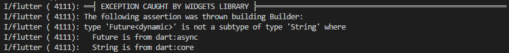
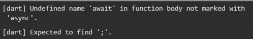

# [flutter实战5：异步async、await和Future的使用技巧](https://segmentfault.com/a/1190000014396421)


由于前面的**HTTP**请求用到了异步操作，不少小伙伴都被这个问题折了下腰，今天总结分享下实战成果。Dart是一个单线程的语言，遇到有延迟的运算（比如IO操作、延时执行）时，线程中按顺序执行的运算就会阻塞，用户就会感觉到卡顿，于是通常用异步处理来解决这个问题。当遇到有需要延迟的运算（**async**）时，将其放入到延迟运算的队列（**await**）中去，把不需要延迟运算的部分先执行掉，最后再来处理延迟运算的部分。

## async和await

首先看一个案例：

```coffeescript
  //HTTP的get请求返回值为Future<String>类型，即其返回值未来是一个String类型的值
  getData() async {    //async关键字声明该函数内部有代码需要延迟执行
    return await http.get(Uri.encodeFull(url), headers: {"Accept": "application/json"}); //await关键字声明运算为延迟执行，然后return运算结果
  }
```

然后我们调用这个函数，想获取其结果：

```haskell
  String data = getData();
```

在书写时，在IDE中这个代码是没有问题的，但是当我们运行这段代码时，就报错了：



为什么呢？因为`data`是**String**类型，而函数`getData()`是一个异步操作函数，其返回值是一个`await`延迟执行的结果。在Dart中，有`await`标记的运算，其结果值都是一个`Future`对象，`Future`不是**String**类型，所以就报错了。

那如果这样的话，我们就没法获取到延迟执行的结果了？当然可以，Dart规定有`async`标记的函数，只能由`await`来调用，比如这样：

```haskell
String data = await getData();
```

但是要使用`await`，必须在有`async`标记的函数中运行，否则这个`await`会报错：


于是，我们要为这个给`data`赋值的语句加一个`async`函数的包装：

```haskell
String data;
setData() async {
  data = await getData();    //getData()延迟执行后赋值给data
}
```

> 上面这种方法一般用于调用封装好的异步接口，比如`getData()`被封装到了其他dart文件，通过使用`async`函数对其调取使用

再或者，我们去掉`async`函数的包装，在`getData()`中直接完成`data`变量的赋值：

```haskell
String data;
getData() async {
  data = await http.get(Uri.encodeFull(url), headers: {"Accept": "application/json"});     //延迟执行后赋值给data
}
```

这样，`data`就获取到HTTP请求的数据了。就这样就完了？是滴，只要记住两点：

- `await`关键字必须在`async`函数内部使用
- 调用`async`函数必须使用`await`关键字

> PS：`await`关键字真的很形象，等一等的意思，就是说，既然你运行的时候都要等一等，那我调用的时候也等一等吧

## Future简单科普

前面个讲到过，直接`return await ...`的时候，实际上返回的是一个延迟计算的`Future`对象，这个`Future`对象是Dart内置的，有自己的队列策略，我们就来聊聊这个[Future](https://link.segmentfault.com/?enc=jdidWAOKrzyPlPzxcqfudA%3D%3D.dVE9uxuHiZAuBIXEs8TUwUYCjgU5UtHXyRVzRtH62U6za7mR%2B%2B5iZrYNZdMP4QMbJY7d7tSw4IVoxK0eaeyO2Q%3D%3D)。

先啰嗦一些关于Dart在线程方面的知识。

**Dart**是基于单线程模型的语言。在**Dart**也有自己的进程（或者叫线程）机制，名叫**isolate**。APP的启动入口`main`函数就是一个**isolate**。玩家也可以通过引入`import 'dart:isolate'`创建自己的**isolate**，对多核CPU的特性来说，多个**isolate**可以显著提高运算效率，当然也要适当控制**isolate**的数量，不应滥用，否则走火入魔自废武功。有一个很重要的点，Dart中**isolate**之间无法直接共享内存，不同的**isolate**之间只能通过**isolate** API进行通信，当然本篇的重点在于`Future`，不展开讲**isolate**，心急的小伙伴可以参考[官方阅读理解](https://link.segmentfault.com/?enc=aInb5GIkKM0klRemvxRhbQ%3D%3D.%2Fko74LLBoTSkVEkSsVWeU6lYGwhQrdB37Wke9k18IWE0U9TRZXaBgvzqtFZUyPHNAjodCVrXPw3uFD%2FkpbzLnZBv4EFZ%2BtcG1mswaQz%2BonrK9%2FWsBIbehS957ag8VqtR)或者参考大神[tain335](https://segmentfault.com/u/tain335)的[人肉翻译](https://link.segmentfault.com/?enc=U8%2FCafHhCr%2BuJ5dL3%2FMXHg%3D%3D.i6lgqZ6c38SH3kBioTwM36CJu3mPvfMpVsiLSqKqXy5sgnxiloo5qMRJrv6icA%2B69Tt9VyszLVi3WVmoMqnpYw%3D%3D)。

**Dart**线程中有一个消息循环机制（**event loop**）和两个队列（**event queue**和**microtask queue**）。

- **event queue**包含所有外来的事件：I/O，mouse events，drawing events，timers，isolate之间的message等。任意**isolate**中新增的**event**（I/O，mouse events，drawing events，timers，isolate的message）都会放入**event queue**中排队等待执行，好比机场的公共排队大厅。
- **microtask queue**只在当前**isolate**的任务队列中排队，优先级高于**event queue**，好比机场里的某个VIP候机室，总是VIP用户先登机了，才开放公共排队入口。

如果在**event**中插入**microtask**，当前**event**执行完毕即可插队执行**microtask**。如果没有**microtask**，就没办法插队了，也就是说，**microtask queue**的存在为Dart提供了给任务队列插队的解决方案。

当`main`方法执行完毕退出后，**event loop**就会以FIFO(先进先出)的顺序执行**microtask**，当所有**microtask**执行完后它会从**event queue**中取事件并执行。如此反复，直到两个队列都为空，如下流程图：


> 注意：当事件循环正在处理**microtask**的时候，**event queue**会被堵塞。这时候app就无法进行UI绘制，响应鼠标事件和I/O等事件。胡乱插队也是有代价的~

虽然你可以预测任务执行的顺序，但你无法准确的预测到事件循环何时会处理你期望的任务。例如当你创建一个延时1s的任务，但在排在你之前的任务结束前事件循环是不会处理这个延时任务的，也就是或任务执行可能是大于1s的。

OK，了解以上信息之后，再来回到**Future**，小伙伴可能已经被绕晕了。

**Future**就是**event**，很多**Flutter**内置的组件比如前几篇用到的Http（http请求控件）的`get`函数、RefreshIndicator（下拉手势刷新控件）的`onRefresh`函数都是**event**。每一个被`await`标记的句柄也是一个**event**，每创建一个**Future**就会把这个**Future**扔进**event queue**中排队等候安检~

什么？那**microtask**呢？当然不会忘了这个，[scheduleMicrotask](https://link.segmentfault.com/?enc=W6OifGrqY7GHrqBXYUvxeQ%3D%3D.YiwmwWsNcnaWS4fpdU0jLbg4y9f5gJA8ds25aHn08isuzr8P20VhqtuPUBSMx%2BhwPkkUL5HhzFOS0ZiAkOFlAXBN1ODbmwqzIEb3Gygaerg%3D)，用法和**Future**基本一样。

## 为什么要用Future？

前面讲到，用`async`和`await`组合，即可向**event queue**中插入**event**实现异步操作，好像**Future**的存在有些多余的感觉，刚开始我本人也有这样的疑惑，且往下看。

当定义**Flutter**函数时，还可以指定其运行结果返回值的类型，以提高代码的可读性：

```dart
//定义了返回结果值为String类型
Future<String> getDatas(String category) async {
    var request = await _httpClient.getUrl(Uri.parse(url));  
    var response = await request.close();
    return await response.transform(utf8.decoder).join();
}

run() async{
    int data = await getDatas('keji');    //因为类型不匹配，IDE会报错
}
```

**Future**最主要的功能就是提供了链式调用。熟悉ES6语法的小伙伴乐开了花，链式调用解决两大问题：明确代码执行的依赖关系和实现异常捕获。WTF?还不明白？且看下面这些案例：

```lasso
//案例1
funA() async{
  ...set an important variable...
}

funB() async{
  await funA();
  ...use the important variable...
}

main() async {
  funB();   
}
//如果要想先执行funA再执行funB，必须在funB中await funA();
//funB的代码与funA耦合，将来如果funA废掉或者改动，funB中还需要经过修改以适配变更。

//案例2
funA() async{
  try{
     ...set an important variable...
  }catch(e){
    do sth...
  }finally{
    do sth. else...
  }
}

funB() async{
  try{
     ...use the important variable...
  }catch(e){
    do sth...
  }finally{
    do sth. else...
  }
}

main() async {
  await funA();
  await funB();
}
//没有明确体现出设置变量和使用变量之间的依赖关系，其他开发者难以理解你的代码逻辑，代码维护困难
//并且如果为了防止funA()或者funB()因发生异常导致程序崩溃
//要到funA()或者funB()中分别加入`try`、`catch`、`finally`
```

为了解决上面的问题，**Future**提供了一套非常简洁的解决方案：

```reasonml
//案例3
 funA(){
  ...set an important variable...    //设置变量
}

funB(){
  ...use the important variable...   //使用变量
}
main(){
  new Future.then(funA()).then(funB());   // 明确表现出了后者依赖前者设置的变量值
 
  new Future.then(funA()).then((_) {new Future(funB())});    //还可以这样用

  //链式调用，捕获异常
  new Future.then(funA(),onError: (e) { handleError(e); }).then(funB(),onError: (e) { handleError(e); })  
}
```

案例3的玩法是`async`和`await`无法企及的，因此掌握**Future**还是很有必要滴。当然了，**Future**的玩法不仅仅局限于案例3，还有很多有趣的玩法，包括和**microtask**对象[scheduleMicrotask](https://link.segmentfault.com/?enc=Hqd43n8rB8cGAl%2FJzlk01g%3D%3D.A5W16L4JKw11%2F0j3uoUD5unZxz6LD6vdaJA%2BVnBF8JrzpVy%2BJWp2LAkTLFw4EGVxRNtoDZDxgj%2F%2BiTjW%2BASk5KqQ4Kgi9MNNf0DvXbLNY0g%3D)配合使用，我这里就不一一介绍了，大家参考大神[tain335](https://segmentfault.com/u/tain335)的[人肉翻译](https://segmentfault.com/a/1190000008800122#articleHeader6)或者[官网阅读理解](https://link.segmentfault.com/?enc=LcCNGaQYfmTDp1yEcT5hLg%3D%3D.hRf9NHVx0c3hay63qs815iPtdupIBjjnXBJbiq%2Fy9EEZTBnflbDHbh8uYpQwMHEtzqzeYZBPcPqa9BCmb0HfFg%3D%3D)吧。

## 总结

Dart的**isolate**中加入了**event queue**和**microtask queue**后，有了一点协程的感觉，或许这就是**Flutter**为啥在性能上敢和原生开发叫板的原因之一吧。本篇的内容比较抽象，如果还是有不明白的小伙伴，欢迎留言提问，我尽量回答，哈哈哈，就酱，欢迎加入到[Flutter圈子](https://link.segmentfault.com/?enc=cIBqr5TmOyucnvoGeAog0w%3D%3D.hGTowXQWtRW8LavxwqF9xhYQ9Ir5tImV7h%2FxPJMMUuzPacGv74sDps2wMakTiWVT)或**flutter 中文社区（官方QQ群：338252156）**，群里有前后端及全栈各路大神镇场子，加入进来没事就写写APP挣点外快（这个真的有），顺便翻译翻译官方英文原稿拉一票粉丝，一举多得何乐而不为呢。

[iOS开发](https://segmentfault.com/t/iOS开发)[android](https://segmentfault.com/t/android)[javascript](https://segmentfault.com/t/javascript)[dart](https://segmentfault.com/t/dart)

